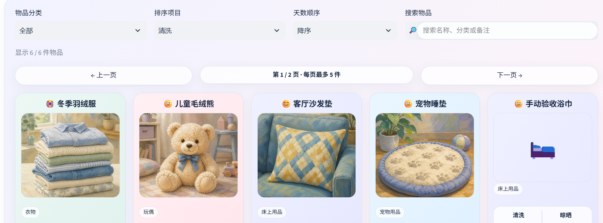
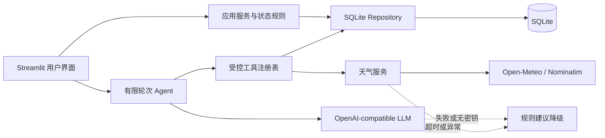

# AI 家庭洗晒助手 / Smart Laundry Agent

[](https://github.com/1326705621-cmyk/smart-laundry-agent/actions/workflows/tests.yml)
[](https://www.python.org/)
[](LICENSE)

一个使用 Python、Streamlit 和 SQLite 构建的家庭洗晒管理项目。应用结合物品记录与实时天气生成生活管理建议，并在没有模型密钥或外部服务失败时自动使用规则模式。



## 当前进度

已完成可运行、可测试、可演示的作品集版本，并扩展了本地账户、多家庭共享空间、家庭码、数据隔离和管理员外观设计。

## 项目价值

普通洗晒提醒只关注日期，本项目把物品周期、历史记录、所在城市天气和家庭协作放进同一流程：系统先取得可验证的数据，再生成建议；用户确认完成后，活动记录和下次状态会同步更新。

## 技术栈

- Python 3.11、Streamlit、SQLite
- Open-Meteo API、OpenStreetMap Nominatim
- OpenAI Responses API、原生 Tool Calling、Pydantic
- Pillow、Requests、python-dotenv、Pytest

## 已实现功能

- Streamlit 中文页面与规则模式提示
- 首次进入需要使用邮箱或手机号创建个人账户，密码使用 PBKDF2 哈希保存
- 每个账户拥有独立个人空间，并可创建或加入多个家庭
- 创建家庭自动生成 8 位家庭码；同一家庭成员共享物品和状态修改
- 个人空间与不同家庭之间使用作用域查询隔离数据
- SQLite 自动初始化和持久化
- 物品名称、类别、清洗周期、晾晒周期和备注管理
- 清洗、晾晒周期均可留空；未设置的维度不参与到期提醒
- 添加、查看、编辑、二次确认删除
- 状态页可搜索名称、分类或备注，并可按清洗/晾晒天数升降序排列、按分类筛选
- 物品固定为衣物、床上用品、玩偶、宠物用品四类，每类使用统一颜色
- 顶部“外观设计”使用一套连续的区域颜色编辑器，不再分成两个标签
- 页面大背景、账户栏、标题、天气栏、城市框、提醒、三个导航标签、状态区、筛选框、翻页、四类物品卡片、图片框、分类标签、状态小框、记录框、按钮和两个功能区等 24 个区域均可独立调整
- 固定五卡一页的整齐响应式布局，避免样式设置造成挤压、错位或卡片底边不齐
- 外观设计保存在 SQLite 中，刷新、退出或重启后仍然有效，也可一键恢复默认
- 每个区域可调整纯色、渐变、毛玻璃、透明度、边框、圆角、阴影和文字颜色，不开放位置、尺寸、字体和间距修改
- 首个账户是唯一页面管理员；只有管理员可见并可调用外观编辑，普通用户只看到管理员发布后的正常网页
- 外观设计只在点击“保存并应用”后写入；成功后自动关闭预览、刷新页面并提示
- 状态页使用左右按钮翻页，固定每页五个等宽槽位；末页不足五件时右侧留空，卡片不会拉伸
- 物品图片框采用固定尺寸，有图、无图或原图比例不同都不会挤动下方内容
- 状态卡片可直接打开编辑/删除窗口，添加物品使用独立加号入口
- 输入校验和参数化 SQL
- 空数据库一键载入演示数据
- 首页直接勾选“今天已清洗 / 今天已晾晒”
- 自动计算距离上次操作的天数和周期比例
- 晴天且到期时显示愤怒表情提醒
- Open-Meteo 免密钥实时天气、30 分钟缓存和失败降级
- 白色主背景、低饱和紫蓝/灰粉/薄荷绿标签和分类渐变卡片主题
- 城市、日期、单字天气和待关注数量统一在一行展示
- 手动选择的城市保存到账户，刷新或重新登录后仍会恢复
- 手机首次使用可在浏览器授权后自动定位城市；失败时继续使用手动选择
- 本地物品图片上传、格式校验与压缩
- 添加物品时提供与最终卡片同为 1.16:1 的图片预览框，可拖动、缩放、重置并确认裁剪；未确认前不会保存物品
- 五张随项目提供的莫兰迪油画演示图；用户上传图片始终优先显示
- “需要关注”只列真正到清洗周期的物品
- 智能助手统一承载规则计划与可选 OpenAI Responses API 建议
- 计划必须结合当前城市天气与物品周期；雨天或高湿时明确暂缓户外洗晒
- 无密钥、超时或模型失败时自动退回规则计划
- 三个受控工具：天气查询、物品记录查询、确认后完成任务
- 最多 5 轮的 Tool Calling Agent、参数校验和工具摘要
- Agent 写操作先显示待确认动作，确认后才更新 SQLite
- 每件物品可展开查看最近 5 条清洗、晾晒历史及记录来源
- 同日重复操作不会重复写入，并显示准确提示
- 活动记录和物品最近日期在同一事务中更新，任一步失败都会整体回滚
- Agent 拒绝写入晚于今天的完成日期
- 临时数据库隔离测试

## 环境要求

- Windows
- Conda
- Python 3.11（推荐使用本项目独立环境）

## 安装

克隆仓库并进入项目目录：

```powershell
git clone https://github.com/1326705621-cmyk/smart-laundry-agent.git
cd smart-laundry-agent
```

在 Anaconda Prompt 中创建独立环境并安装：

```powershell
conda create -n smart-laundry python=3.11 -y
conda activate smart-laundry
python -m pip install -e ".[dev]"
```

复制环境变量示例（节点 0 不要求填写模型密钥）：

```powershell
Copy-Item .env.example .env
```

## 启动页面

```powershell
python -m streamlit run app.py
```

浏览器将显示本地访问地址。未配置 `OPENAI_API_KEY` 时，页面会显示“规则建议模式”，不会启动失败。

首次打开时先创建个人账户。第一个账户会接管升级前已有的本地物品；之后创建的账户拥有独立的空个人空间。家庭管理窗口可以创建家庭并复制家庭码，也可以输入家庭码加入已有家庭。

页面中的“今天”取自运行设备日期。天气使用城市解析和当日预报，相同城市缓存 30 分钟。城市偏好保存在账户中；定位仅在尚未保存城市的手机端尝试一次。浏览器授权后，坐标会发送给 OpenStreetMap Nominatim 用于识别城市，但精确经纬度不会写入项目数据库。

## 运行测试

```powershell
python -m pytest
```

## 演示数据

空数据库可在页面点击“一键载入演示数据”，也可执行：

```powershell
python scripts/seed_demo_data.py
```

脚本可以重复运行；已存在的同名演示物品不会再次插入。开发数据库默认位于 `data/smart_laundry.db`，该文件不会提交到 Git。

## 配置项

| 配置 | 用途 | 节点 0 是否必填 |
| --- | --- | --- |
| `DEFAULT_CITY` | 默认天气城市 | 否，默认北京 |
| `DATABASE_PATH` | SQLite 数据库位置 | 否 |
| `OPENAI_API_KEY` | 模型服务密钥 | 否 |
| `OPENAI_MODEL` | 模型名称 | 否 |
| `OPENAI_BASE_URL` | 兼容服务地址 | 否 |

真实密钥只能保存在本地 `.env` 或 Streamlit secrets 中，不得提交到 Git。

只有同时配置 `OPENAI_API_KEY` 和 `OPENAI_MODEL` 才会尝试 AI Agent；否则“智能助手”使用规则模式。无论哪种模式，洗晒计划都必须同时取得天气和物品事实。图片选择、构图预览和裁剪都在本机完成，最终图片只保存在本地 `data/uploads/`，单张最大 5 MB，不会发送给模型或提交到 Git。

## 项目结构

```text
aimini/
├─ app.py
├─ assets/demo/                # 本地莫兰迪油画演示图
├─ src/smart_laundry/
│  ├─ __init__.py
│  ├─ accounts.py
│  ├─ config.py
│  ├─ agent.py
│  ├─ database.py
│  ├─ demo_data.py
│  ├─ image_cropper_component.py
│  ├─ image_storage.py
│  ├─ item_views.py
│  ├─ models.py
│  ├─ recommendations.py
│  ├─ repositories.py
│  ├─ status_rules.py
│  ├─ tools.py
│  └─ weather.py
├─ scripts/seed_demo_data.py
├─ tests/
├─ notebooks/
├─ data/.gitkeep
├─ .env.example
├─ pyproject.toml
└─ README.md
```

## 架构与数据流



详细说明见 [系统架构](docs/architecture.md)、[演示流程](docs/demo.md)、[简历描述](docs/resume.md) 和 [面试问答](docs/interview_qa.md)。

## 安全与隐私

- 密码仅保存 PBKDF2 哈希和随机盐，不保存明文。
- API 密钥只从 `.env` 或 Streamlit secrets 读取。
- 数据库、上传图片、运行日志、缓存和内部协作文件均由 `.gitignore` 排除。
- Agent 写操作必须由用户确认，SQL 使用参数化查询，活动记录使用事务写入。

## 当前限制

当前尚未实现系统通知和拍照后自动生成动漫图片。家庭共享目前依赖同一个 SQLite 数据库；本地运行适合单机多账户演示，部署到共享服务器后才能让不同设备访问同一家庭。历史页面目前展示每件物品最近 5 条记录，完整记录仍保存在 SQLite。Agent 模型路径需要用户自行配置合法的 API key 与支持工具调用的模型；无配置时使用完整规则模式。

## License

本项目采用 [MIT License](LICENSE)。
