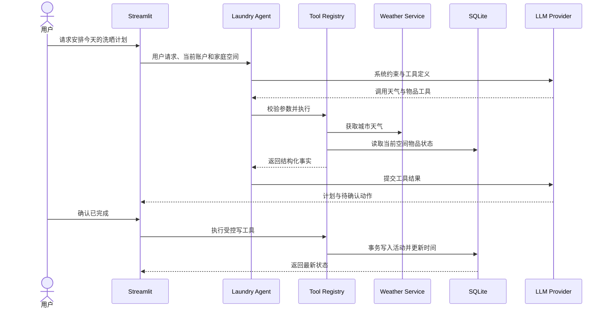

# 系统架构

## 设计目标

Smart Laundry Agent 将确定性的家庭物品数据和状态规则，与可能失败或产生不确定输出的天气、LLM 服务隔离。即使没有模型密钥或网络暂时不可用，用户仍能管理物品并获得规则建议。

## 模块职责

| 层 | 主要文件 | 职责 |
| --- | --- | --- |
| 页面层 | `app.py` | 账户、空间切换、状态卡片、智能助手、表单和确认交互 |
| 应用层 | `agent.py`、`recommendations.py` | Agent 循环、计划生成、规则降级 |
| 工具层 | `tools.py` | 天气查询、物品查询、受控任务写入及参数校验 |
| 领域层 | `models.py`、`status_rules.py`、`item_views.py` | 数据模型、周期状态、筛选和排序 |
| 数据层 | `database.py`、`repositories.py`、`accounts.py` | SQLite 建表、事务、CRUD、账户与家庭作用域 |
| 外部服务 | `weather.py` | 城市解析、天气查询、缓存、统一响应和错误映射 |
| 展示扩展 | `visual_design.py`、`visual_designer_component.py` | 管理员外观配置、白名单校验和 CSS 生成 |

## 核心数据流

## 安全边界

- 账户密码采用 PBKDF2 哈希和随机盐；密钥不进入数据库。
- Repository 的查询包含个人或家庭作用域，避免跨空间读取。
- Agent 只能调用注册表中的固定工具，不能执行任意 SQL、命令或 URL。
- 写操作使用稳定物品 ID，并在 UI 中显式确认。
- 工具参数由 Pydantic 校验，Agent 最多运行 5 轮。
- 数据库、上传图片、日志和本地密钥不会提交到 Git。

## 降级策略

天气失败时，计划只依据物品到期程度并说明天气不可用；模型无密钥、限流、超时或响应异常时，应用直接使用规则引擎。降级不会伪装成模型调用成功，也不会影响物品 CRUD 和历史记录。
